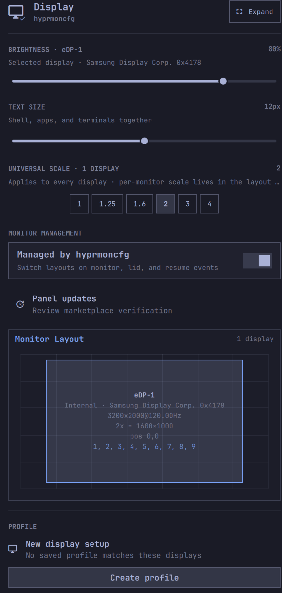
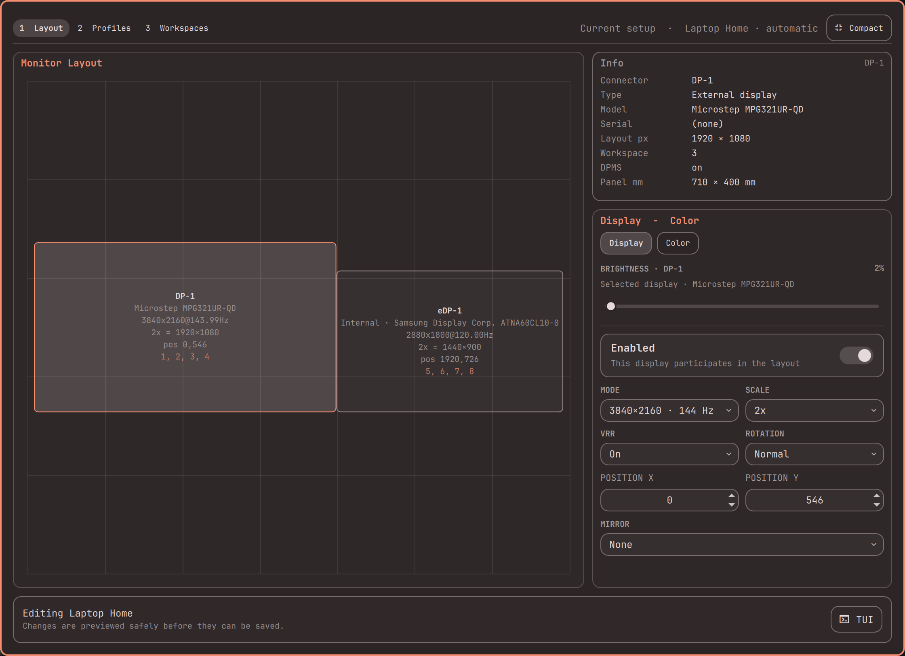

# Display+ for Omarchy

One panel for every display setting. Brightness, text size, and universal
scale sit on the front page — one click from the bar — with hyprmoncfg's full
multi-monitor layout editor underneath.



## The problem

Omarchy ends up with two display panels that overlap. The stock panel gives you
brightness, text size, and scale for the focused display; hyprmoncfg gives you
auto-switching monitor layouts, profiles, and per-display brightness — but its
scale control lives a level or two deep in the layout editor, and it has no
text-size control at all. So both icons sit on the bar, and changing how big
things look means remembering which panel has which knob.

Display+ collapses the two into one pane:

- **Brightness** — per-display, right on the front page (from hyprmoncfg)
- **Text size** — a slider with the stock panel's curated stops (9–20px),
  applied across shell, apps, and terminals together (from the stock panel)
- **Universal scale** — one click sets the same scale on every connected
  display, then rides hyprmoncfg's confirm-revert dialog so a bad choice
  undoes itself in 10 seconds
- **Per-monitor scale** stays in the expanded layout editor, where it belongs
- Everything else hyprmoncfg does — auto profiles on hotplug/lid/resume,
  mirroring, rotation, colour management, workspace planning — unchanged

<details>
<summary>See the expanded editor</summary>



</details>

## Install

Requires the upstream hyprmoncfg daemon — it stays the backend and keeps doing
the profile switching:

```sh
omarchy pkg aur add hyprmoncfg-bin   # if not already installed
omarchy plugin add https://github.com/gdeyoung/omarchy-displayplus.git --enable
```

If you had the stock display panel or upstream hyprmoncfg on your bar, disable
them — Display+ replaces both:

```sh
omarchy plugin disable omarchy.monitor
omarchy plugin disable crmne.hyprmoncfg   # if installed
```

## Remove

```sh
omarchy plugin remove gdeyoung.hyprmoncfg
```

The hyprmoncfg daemon and your saved profiles are untouched; reinstall the
upstream panel (`omarchy plugin add https://github.com/crmne/omarchy-hyprmoncfg.git --enable`)
or re-enable `omarchy.monitor` to get a bar panel back.

## Credits

Fork of [hyprmoncfg for Omarchy](https://github.com/crmne/omarchy-hyprmoncfg)
by Carmine Paolino (MIT), which does all the hard work — Display+ only
reorganizes the front page. Text size uses Omarchy's own
`omarchy-display-text-size` CLI, so it stays consistent with the stock panel.

## Development

```sh
node --test tests/
omarchy plugin validate .
```

Fork additions live in `TextSizeControl.qml` and `UniversalScaleControl.qml`;
everything else is upstream code, so diff against
[crmne/omarchy-hyprmoncfg](https://github.com/crmne/omarchy-hyprmoncfg) to see
exactly what changed.
